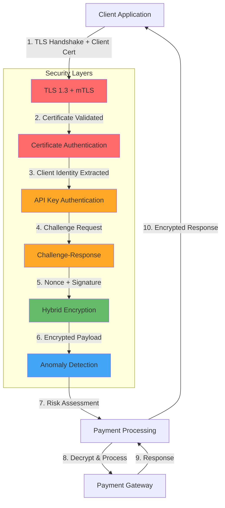
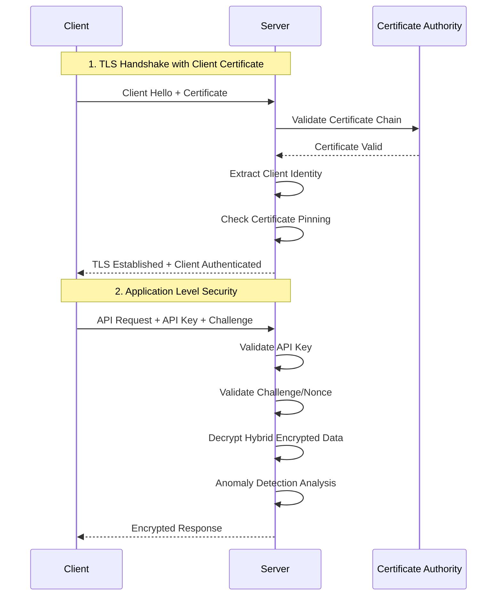

# Payment System with Enterprise RSA Key Management & Mutual TLS

**Enterprise-grade Payment System with Multi-Layer Security Architecture**


## 🔐 Advanced Security Features

### Multi-Layer Authentication
- **🛡️ Mutual TLS (mTLS)**: Network-level client certificate authentication
- **🔑 API Key Authentication**: Application-level access control
- **🎯 Challenge-Response**: Anti-replay protection with nonces
- **🔐 Hybrid Encryption**: RSA-2048 + AES-256 combination for unlimited data size
- **🤖 ML-based Anomaly Detection**: Real-time suspicious pattern detection

### Enterprise Security Architecture
- **Environment Isolation**: Separate keys for Development, Staging, Production
- **Key Rotation**: Automated key lifecycle management with backup strategies
- **PCI DSS Compliance**: Credit card data protection and sensitive data masking
- **GDPR Ready**: Privacy by design with automatic data clearing

### Performance & Scalability
- **Clean Architecture**: Feature-based folder structure with clear separation of concerns
- **Microservices**: Separate Payment API and Client API services
- **API Gateway Pattern**: Client API as gateway to Payment API
- **Enterprise Patterns**: Repository, Service, and Factory patterns

## 🏗️ Security Architecture

### Network Security (Layer 1: Transport)
```
Client Certificate ←→ TLS 1.3 ←→ Server Certificate
        ↓                           ↓
   Client Identity              Server Identity
   Verification               Verification
```

### Application Security (Layer 2: Application)
```
API Key → Challenge → Encryption → Anomaly Detection → Processing
   ↓         ↓           ↓              ↓              ↓
 Auth     Anti-Replay  Data Protection  ML Analysis   Business Logic
```

### Data Security (Layer 3: Data)
```
RSA Public Key → AES Session Key → Hybrid Encryption → Secure Processing
      ↓              ↓                    ↓                 ↓
   Key Exchange   Symmetric Encrypt   Unlimited Size    Zero Storage
```

## Table of Contents

- [Quick Start](#quick-start)
- [Security Setup](#security-setup)
- [Architecture](#architecture)
- [mTLS Configuration](#mtls-configuration)
- [Key Management](#key-management)
- [API Documentation](#api-documentation)
- [Security Testing](#security-testing)
- [Deployment](#deployment)
- [Contributing](#contributing)

## Quick Start

### Prerequisites

- [.NET 9.0 SDK](https://dotnet.microsoft.com/download/dotnet/9.0)
- [OpenSSL](https://www.openssl.org/) (for certificate generation)
- [Git](https://git-scm.com/)

### 1. Clone Repository

```bash
git clone https://github.com/furkansarikaya/payment-system.git
cd payment-system
```

### 2. Generate Security Infrastructure

#### Generate RSA Keys
```bash
cd tools/PaymentSystem.KeyManager
dotnet build -c Release

# Generate keys for all environments
dotnet run -- generate \
  --output "../../src/PaymentSystem.PaymentApi/keys/payment-keys.json" \
  --environments development staging production \
  --key-size 2048
```

#### Generate Client Certificates (mTLS)
```bash
cd tools/scripts
chmod +x generate-client-certificates.sh
./generate-client-certificates.sh
```

This will create:
- **Certificate Authority (CA)**: For signing client certificates
- **Client Certificates**: For different security levels
    - `demo_client.p12` - Development client
    - `high_security_client_1.p12` - Enterprise client
    - `financial_client_bank.p12` - Financial institution client
    - `enterprise_client_corp.p12` - Corporate client

### 3. Configure Security Settings

Update `src/PaymentSystem.PaymentApi/appsettings.json`:

```json
{
  "Security": {
    "RequireClientCertificate": true,
    "TrustedCertificateAuthorities": [
      "YOUR_CA_THUMBPRINT_HERE"
    ],
    "PinnedCertificates": {
      "high_security_client_1": "CLIENT_CERT_THUMBPRINT",
      "financial_client_bank": "FINANCIAL_CERT_THUMBPRINT"
    }
  }
}
```

### 4. Start Services with Maximum Security

```bash
# Terminal 1 - Payment API (with mTLS)
cd src/PaymentSystem.PaymentApi
dotnet run

# Terminal 2 - Client API (with certificate)
cd src/PaymentSystem.ClientApi
dotnet run
```

### 5. Test Secure Payment

```bash
# Test with client certificate
curl -X POST https://localhost:7001/api/customer/payment \
  -H "Content-Type: application/json" \
  -H "X-API-Key: ak_test_payment_demo_12345" \
  --cert certificates/clients/demo_client.p12:client123 \
  -k \
  -d '{
    "creditCard": {
      "cardNumber": "4111111111111111",
      "cardHolderName": "SECURE TEST USER",
      "expiryDate": "12/25",
      "cvv": "123"
    },
    "amount": 100.50,
    "currency": "TRY",
    "description": "mTLS secured payment",
    "customerEmail": "secure@example.com",
    "orderReference": "SECURE-001"
  }'
```

## Security Setup

### Development vs Production Security

#### Development Mode
```bash
# Relaxed for development
export ASPNETCORE_ENVIRONMENT=Development
```
- Self-signed certificates accepted
- Client certificates optional
- Detailed error messages
- Enhanced logging

#### Production Mode
```bash
# Maximum security for production  
export ASPNETCORE_ENVIRONMENT=Production
```
- Client certificates **REQUIRED**
- Certificate chain validation
- Certificate pinning enforced
- Minimal error disclosure
- Security audit logging

### Security Levels Comparison

| Security Feature | Development | Staging | Production |
|------------------|-------------|---------|------------|
| **mTLS Required** | Optional | Required | **MANDATORY** |
| **Certificate Pinning** | Disabled | Enabled | **ENFORCED** |
| **API Key Auth** | Required | Required | **REQUIRED** |
| **Challenge-Response** | Enabled | Enabled | **ENABLED** |
| **Anomaly Detection** | Basic | Enhanced | **ML-POWERED** |
| **Rate Limiting** | Relaxed | Moderate | **STRICT** |
| **Audit Logging** | Basic | Detailed | **COMPREHENSIVE** |

## Architecture

### Enhanced Security Flow Diagram



### mTLS Authentication Flow



## mTLS Configuration

### Certificate Management

#### Certificate Authority Setup
```bash
# CA certificate is the root of trust
tools/certificates/ca/ca-cert.pem      # Public CA certificate
tools/certificates/ca/ca-key.pem       # Private CA key (SECURE!)
```

#### Client Certificate Types

**1. Development Client (`demo_client.p12`)**
- **Purpose**: Development and testing
- **Security Level**: Standard
- **Validation**: Basic certificate checks
- **Password**: `client123`

**2. High Security Client (`high_security_client_1.p12`)**
- **Purpose**: Enterprise applications
- **Security Level**: Enhanced
- **Validation**: Certificate pinning + chain validation
- **Features**: Revocation checking, strict validation

**3. Financial Client (`financial_client_bank.p12`)**
- **Purpose**: Financial institutions
- **Security Level**: Maximum
- **Validation**: Certificate pinning + OCSP + CRL
- **Features**: Enhanced monitoring, strict IP restrictions

### Certificate Configuration

#### appsettings.json Configuration
```json
{
  "Security": {
    "RequireClientCertificate": true,
    "EnableCertificatePinning": true,
    "TrustedCertificateAuthorities": [
      "05EAC632D3BF1575DA891862BC14023ECB41E72E"
    ],
    "PinnedCertificates": {
      "high_security_client_1": "1A0793CCC030168FBB943CD17D941B94E0E2F0EC",
      "financial_client_bank": "F25970C173B453B2C38F8F3D39F55BEDE502187D"
    },
    "AuthorizedClients": [
      "demo_client",
      "high_security_client_1", 
      "financial_client_bank",
      "enterprise_client_corp"
    ],
    "CertificateValidation": {
      "CheckRevocation": true,
      "RequireValidChain": true,
      "AllowSelfSigned": false,
      "CacheValidationResults": true
    }
  }
}
```

#### Client API Certificate Setup
```json
{
  "Security": {
    "EnableClientCertificate": true,
    "ClientCertificatePath": "certificates/client/demo_client.p12",
    "ClientCertificatePassword": "client123"
  }
}
```

### Certificate Security Best Practices

#### Certificate Storage
- **CA Private Key**: Store in HSM or secure key vault
- **Client Certificates**: Distribute securely to authorized clients only
- **File Permissions**: 600 (owner read/write only)
- **Backup Strategy**: Encrypted backups with separate storage

#### Certificate Rotation
```bash
# Generate new client certificate
./tools/scripts/generate-client-certificates.sh

# Update certificate pinning configuration
# Deploy new certificate to client
# Update server configuration
# Remove old certificate from authorized list
```

#### Revocation Procedures
1. **Immediate Revocation**: Remove from `AuthorizedClients` list
2. **Certificate Blacklist**: Add thumbprint to blacklist
3. **OCSP/CRL Update**: Update revocation lists
4. **Client Notification**: Inform client of new certificate requirement

## Key Management

### Enhanced Multi-Environment Strategy

```json
{
  "environments": {
    "development": {
      "currentKey": { 
        "keyId": "DEV_PAYMENT_20241215_A1B2C3D4",
        "certificateIntegration": true 
      },
      "securityLevel": "standard",
      "mTLSRequired": false
    },
    "production": {
      "currentKey": { 
        "keyId": "PROD_PAYMENT_20241215_X9Y8Z7W6",
        "certificateIntegration": true 
      },
      "securityLevel": "maximum",
      "mTLSRequired": true,
      "certificatePinning": true
    }
  }
}
```

### Security Integration

The key management system now integrates with certificate-based authentication:

- **Certificate-Key Binding**: Each environment's keys are associated with specific client certificates
- **Enhanced Validation**: Both RSA keys and client certificates must be valid
- **Coordinated Rotation**: Key rotation triggers certificate validation refresh
- **Cross-Layer Security**: Network and application security work together

## API Documentation

### Enhanced Security Headers

All API responses now include comprehensive security metadata:

```http
HTTP/1.1 200 OK
X-Security-Level: Enhanced
X-Client-Certificate-Valid: true
X-Certificate-Trust-Level: Maximum
X-Client-Type: Financial
X-Challenge-Required: true
X-Hybrid-Encryption: enabled
X-Anomaly-Score: 0.12
X-Risk-Level: Low
```

### mTLS-Enhanced Endpoints

#### Payment Processing with mTLS
```http
POST /api/payment/process
X-API-Key: ak_live_production_67890
Content-Type: application/json
TLS-Client-Certificate: [Certificate Authentication]

{
  "encryptedData": "{ hybrid encrypted JSON }",
  "requestId": "REQ_20241215_143022_ABC123",
  "timestamp": "2024-12-15T14:30:22.123Z",
  "nonce": "CHG_20241215143022_SECURE123",
  "clientSignature": "HMAC-SHA256-SIGNATURE"
}
```

#### Certificate Information Endpoint
```http
GET /api/security/certificate-info
X-API-Key: ak_live_production_67890

Response:
{
  "certificateValid": true,
  "clientIdentity": {
    "clientId": "financial_client_bank",
    "organizationName": "Financial Bank Ltd",
    "certificateType": "Financial",
    "trustLevel": "Maximum",
    "expiresAt": "2025-12-15T10:00:00.000Z"
  },
  "securityFeatures": [
    "certificate-pinning",
    "revocation-checking", 
    "chain-validation"
  ]
}
```

## Security Testing

### mTLS Testing Scenarios

#### 1. Valid Certificate Test
```bash
# Test with valid client certificate
curl -X GET https://localhost:7000/api/payment/health \
  --cert certificates/clients/demo_client.p12:client123 \
  -H "X-API-Key: ak_test_payment_demo_12345" \
  -k
```

#### 2. Invalid Certificate Test
```bash
# Test without certificate (should fail)
curl -X GET https://localhost:7000/api/payment/health \
  -H "X-API-Key: ak_test_payment_demo_12345" \
  -k
# Expected: 401 CLIENT_CERTIFICATE_REQUIRED
```

#### 3. Certificate Pinning Test
```bash
# Test with wrong certificate for pinned client
curl -X GET https://localhost:7000/api/payment/health \
  --cert certificates/clients/wrong_client.p12:password \
  -H "X-API-Key: ak_live_production_67890" \
  -k
# Expected: 403 CERTIFICATE_PINNING_FAILED
```

### Security Validation Checklist

- [ ] **Network Security**
    - [ ] mTLS handshake successful
    - [ ] Client certificate validation
    - [ ] Certificate chain verification
    - [ ] Certificate pinning (production)

- [ ] **Application Security**
    - [ ] API key authentication
    - [ ] Challenge-response validation
    - [ ] Hybrid encryption/decryption
    - [ ] Anomaly detection active

- [ ] **Data Security**
    - [ ] Sensitive data masking
    - [ ] No data persistence
    - [ ] Memory clearing
    - [ ] Audit trail complete

## Deployment

### Production Security Checklist

#### Certificate Security
- [ ] CA private key stored in HSM
- [ ] Client certificates distributed securely
- [ ] Certificate pinning configured
- [ ] Revocation procedures documented
- [ ] File permissions set correctly (600)

#### Network Security
- [ ] TLS 1.3 enforced
- [ ] Client certificates required
- [ ] Certificate validation enabled
- [ ] OCSP/CRL checking active
- [ ] Security headers configured

#### Application Security
- [ ] API keys rotated for production
- [ ] Rate limiting configured
- [ ] Anomaly detection tuned
- [ ] Audit logging enabled
- [ ] Error messages sanitized

### Docker Deployment with mTLS

```dockerfile
# Enhanced Dockerfile with certificate support
FROM mcr.microsoft.com/dotnet/aspnet:9.0 AS base
WORKDIR /app
EXPOSE 80
EXPOSE 443

# Create secure directories
RUN mkdir -p /app/certificates/ca /app/certificates/clients && \
    chmod 700 /app/certificates

# Copy certificates (build-time only for demo)
COPY certificates/ /app/certificates/
RUN chmod 400 /app/certificates/clients/*.p12

ENTRYPOINT ["dotnet", "PaymentSystem.PaymentApi.dll"]
```

### Environment Security Configurations

| Environment | mTLS | Cert Pinning | Validation | Monitoring |
|-------------|------|--------------|------------|------------|
| **Development** | Optional | Disabled | Basic | Console logs |
| **Staging** | Required | Enabled | Enhanced | Basic APM |
| **Production** | **MANDATORY** | **ENFORCED** | **STRICT** | **FULL APM** |

## Contributing

### Security Development Guidelines

When contributing to this security-focused payment system:

#### Code Security Standards
- All cryptographic operations must use approved algorithms
- Certificate validation must never be bypassed
- Security configurations must be environment-specific
- Sensitive data must never be logged or stored

#### Testing Security Features
```bash
# Run security tests
dotnet test --filter Category=Security

# Test certificate validation
dotnet test --filter TestCategory=CertificateValidation

# Test mTLS integration
dotnet test --filter TestCategory=mTLS
```

#### Security Review Process
1. **Code Review**: Security-focused code review required
2. **Penetration Testing**: Security testing for major changes
3. **Certificate Management**: Changes to certificate handling need extra review
4. **Compliance Check**: Ensure PCI DSS compliance maintained

## License

This project is licensed under the MIT License - see the [LICENSE](LICENSE) file for details.

## Acknowledgments

- **Microsoft**: .NET 9.0 and Application Insights
- **OpenSSL**: Certificate generation and management
- **Security Community**: mTLS best practices and implementation guidance
- **Financial Industry**: PCI DSS compliance requirements

---

**🔐 Maximum Security Payment Processing**

*Network-level security + Application-level protection + Data-level encryption*

**Enterprise-grade payment processing with multi-layer security architecture**
## 🌟 Star History

If you find this library useful, please consider giving it a star on GitHub! It helps others discover the project.

**Made with ❤️ by [Furkan Sarıkaya](https://github.com/furkansarikaya)**

[](https://github.com/furkansarikaya)
[](https://www.linkedin.com/in/furkansarikaya/)
[](https://medium.com/@furkansarikaya)

---

## Support

If you encounter any issues or have questions:

1. Check the [troubleshooting section](#troubleshooting)
2. Search existing [GitHub issues](https://github.com/furkansarikaya/FS.EntityFramework.Library/issues)
3. Create a new issue with detailed information
4. Join our community discussions

**Happy coding! 🚀**