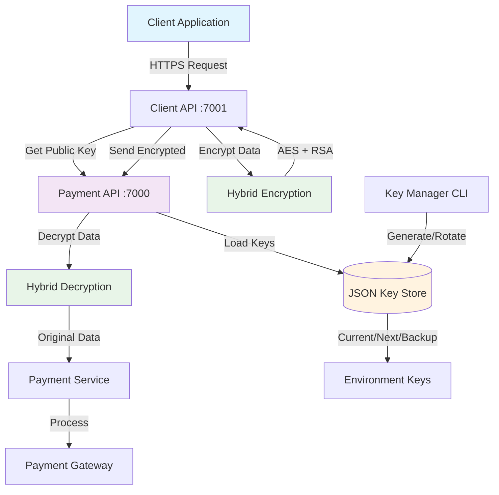
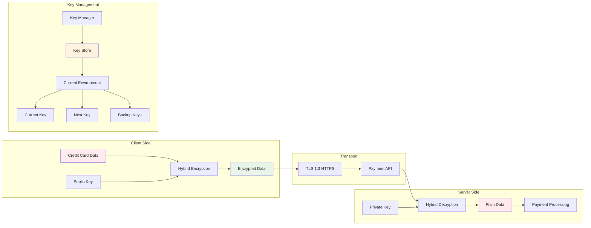

# Payment System with Enterprise RSA Key Management

**Enterprise-grade Payment System with Hybrid RSA+AES Encryption**


## Features

### Advanced Security
- **Hybrid Encryption**: RSA-2048 + AES-256 combination for unlimited data size
- **Environment Isolation**: Separate keys for Development, Staging, Production
- **Key Rotation**: Automated key lifecycle management with backup strategies
- **PCI DSS Compliance**: Credit card data protection and sensitive data masking

### Architecture
- **Clean Architecture**: Feature-based folder structure with clear separation of concerns
- **Microservices**: Separate Payment API and Client API services
- **API Gateway Pattern**: Client API as gateway to Payment API
- **Enterprise Patterns**: Repository, Service, and Factory patterns

### Key Management
- **JSON-based Key Store**: Multi-environment key management with metadata
- **CLI Tool**: Console application for key generation, rotation, and maintenance
- **Zero-downtime Updates**: Hot key reloading without service restart
- **Backup & Recovery**: Automated backup with configurable retention policies

## Table of Contents

- [Quick Start](#quick-start)
- [Architecture](#architecture)
- [Project Structure](#project-structure)
- [Security](#security)
- [Key Management](#key-management)
- [API Documentation](#api-documentation)
- [Deployment](#deployment)
- [Contributing](#contributing)

## Quick Start

### Prerequisites

- [.NET 9.0 SDK](https://dotnet.microsoft.com/download/dotnet/9.0)
- [Git](https://git-scm.com/)

### 1. Clone Repository

```bash
git clone https://github.com/furkansarikaya/payment-system.git
cd payment-system
```

### 2. Generate RSA Keys

```bash
cd tools/PaymentSystem.KeyManager
dotnet build -c Release

# Generate keys for all environments
dotnet run -- generate \
  --output "../../src/PaymentSystem.PaymentApi/keys/payment-keys.json" \
  --environments development staging production \
  --key-size 2048
```

### 3. Start Services

```bash
# Terminal 1 - Payment API
cd src/PaymentSystem.PaymentApi
dotnet run

# Terminal 2 - Client API
cd src/PaymentSystem.ClientApi
dotnet run
```

### 4. Test Payment

```bash
curl -X POST https://localhost:7001/api/customer/payment \
  -H "Content-Type: application/json" \
  -k \
  -d '{
    "creditCard": {
      "cardNumber": "4111111111111111",
      "cardHolderName": "TEST USER",
      "expiryDate": "12/25",
      "cvv": "123"
    },
    "amount": 100.50,
    "currency": "TRY",
    "description": "Test payment",
    "customerEmail": "test@example.com",
    "orderReference": "ORDER-001"
  }'
```

## Architecture

### System Flow Diagram



### Security Architecture



## Project Structure

```
payment-system/
├── src/                                    # Source code
│   ├── PaymentSystem.PaymentApi/           # Main payment processing API
│   │   ├── Features/
│   │   │   ├── Payment/                    # Payment business logic
│   │   │   ├── Encryption/                 # Hybrid encryption
│   │   │   └── Admin/                      # Key management API
│   │   ├── keys/                           # RSA key store (gitignored)
│   │   └── Program.cs
│   └── PaymentSystem.ClientApi/            # Client-facing API
│       ├── Features/
│       │   ├── PaymentClient/              # Client payment logic
│       │   └── Customer/                   # Customer endpoints
│       └── Program.cs
├── tools/                                  # Development tools
│   └── PaymentSystem.KeyManager/           # Key management CLI
│       ├── Models/                         # Key store models
│       ├── Services/                       # Key management services
│       └── Program.cs
├── docs/                                   # Documentation
├── deployment/                             # Deployment configurations
│   └── docker-compose.yml
├── README.md
├── .gitignore
└── PaymentSystem.sln
```

## Security

### Encryption Strategy

This system uses **Hybrid Encryption** to overcome RSA size limitations:

1. **AES-256-CBC**: Encrypts the actual payment data (unlimited size)
2. **RSA-2048-OAEP**: Encrypts the AES key and IV (48 bytes)
3. **TLS 1.3**: Transport layer security

### Key Features

- **No RSA Size Limits**: Can encrypt any size payload
- **Perfect Forward Secrecy**: Each request uses a new AES key
- **Industry Standard**: Same approach used by HTTPS, VPNs, and banking systems
- **Performance Optimized**: ~10x faster than pure RSA for large data

### Sensitive Data Handling

- **Automatic Masking**: Credit card numbers, CVV, emails automatically masked in logs
- **PCI DSS Compliance**: No sensitive data stored or logged
- **GDPR Ready**: Personal data protection and right to be forgotten
- **Audit Trail**: All operations logged for compliance

## Key Management

### Multi-Environment Strategy

```json
{
  "environments": {
    "development": {
      "currentKey": { "keyId": "DEV_PAYMENT_20241215_A1B2C3D4" },
      "nextKey": { "keyId": "DEV_PAYMENT_20241215_B2C3D4E5" },
      "backupKeys": [...]
    },
    "staging": { ... },
    "production": { ... }
  }
}
```

### Key Lifecycle

1. **Generation**: CLI tool creates environment-specific keys
2. **Activation**: Current key used for encryption/decryption
3. **Rotation**: Scheduled replacement with next key
4. **Backup**: Multiple backup keys for disaster recovery
5. **Archival**: Old keys moved to archive for compliance

### CLI Commands

```bash
# Generate new key store
dotnet run -- generate --environments development staging production

# Rotate production keys
dotnet run -- rotate --environment production --input keys/payment-keys.json

# Health check
dotnet run -- validate --input keys/payment-keys.json

# Backup
dotnet run -- backup --input keys/payment-keys.json --backup-dir backups

# View information
dotnet run -- info --input keys/payment-keys.json --environment production
```

## API Documentation

### Payment API (Port 7000)

#### Get Public Key
```http
GET /api/payment/public-key
```

**Response:**
```json
{
  "publicKey": "-----BEGIN RSA PUBLIC KEY-----...",
  "keySize": 2048,
  "hybridSupport": true,
  "maxDirectRsaSize": 190,
  "algorithm": "RSA + AES-256 Hybrid Encryption"
}
```

#### Process Payment
```http
POST /api/payment/process
Content-Type: application/json

{
  "encryptedData": "{ hybrid encrypted JSON }",
  "requestId": "REQ_20241215_143022_ABC123",
  "timestamp": "2024-12-15T14:30:22.123Z"
}
```

### Client API (Port 7001)

#### Customer Payment
```http
POST /api/customer/payment
Content-Type: application/json

{
  "creditCard": {
    "cardNumber": "4111111111111111",
    "cardHolderName": "TEST USER",
    "expiryDate": "12/25",
    "cvv": "123"
  },
  "amount": 100.50,
  "currency": "TRY",
  "description": "Payment description",
  "customerEmail": "customer@example.com",
  "orderReference": "ORDER-001"
}
```

### Admin API

#### Key Store Information
```http
GET /api/admin/keymanagement/info
```

#### Environment Key Status
```http
GET /api/admin/keymanagement/environment/{environment}
```

#### Refresh Key Store
```http
POST /api/admin/keymanagement/refresh
```

## Deployment

### Docker Deployment

```bash
# Build and run with Docker Compose
docker-compose up -d

# Check logs
docker-compose logs -f payment-api
```

### Environment Configuration

| Environment | Port | Key Store Path | Monitoring |
|-------------|------|----------------|------------|
| Development | 7000, 7001 | `keys/payment-keys.json` | Console logs |
| Staging | 8000, 8001 | `/etc/keys/staging-keys.json` | Basic APM |
| Production | 443, 80 | `/secure/keys/prod-keys.json` | Full APM |

### Security Checklist

- [ ] Key store file permissions set to 600
- [ ] TLS certificates configured
- [ ] Environment variables secured
- [ ] Network policies applied
- [ ] Backup procedures implemented
- [ ] Monitoring alerts configured
- [ ] Compliance audit completed

## Contributing

### Development Workflow

1. **Fork** the repository
2. **Create** a feature branch: `git checkout -b feature/your-feature`
3. **Generate** test keys: `dotnet run -- generate` in KeyManager
4. **Develop** your feature with proper logging
5. **Commit** with descriptive messages
6. **Push** to your fork: `git push origin feature/your-feature`
7. **Create** a Pull Request

### Code Standards

- **Clean Architecture**: Feature-based organization
- **SOLID Principles**: Well-structured, maintainable code
- **Security First**: All sensitive data properly handled
- **Documentation**: XML docs for public APIs
- **Logging**: Structured logging with correlation IDs

### Commit Convention

```
feat: add hybrid encryption support
fix: resolve key rotation timing issue
docs: update API documentation
refactor: improve key store service performance
security: enhance sensitive data masking
```

## License

This project is licensed under the MIT License - see the [LICENSE](LICENSE) file for details.

## Acknowledgments

- **Microsoft**: .NET 9.0 and Application Insights
- **Community**: Open source encryption libraries
- **Security Experts**: RSA and AES implementation guidance

## Support

- **GitHub Issues**: [Report bugs or request features](https://github.com/furkansarikaya/payment-system/issues)
- **Documentation**: [Full documentation](docs/)
- **Security Issues**: Please report privately to furkannsarikaya@gmail.com

---

**Built with Security, Performance, and Scalability in Mind**

*Enterprise-grade payment processing for modern applications*