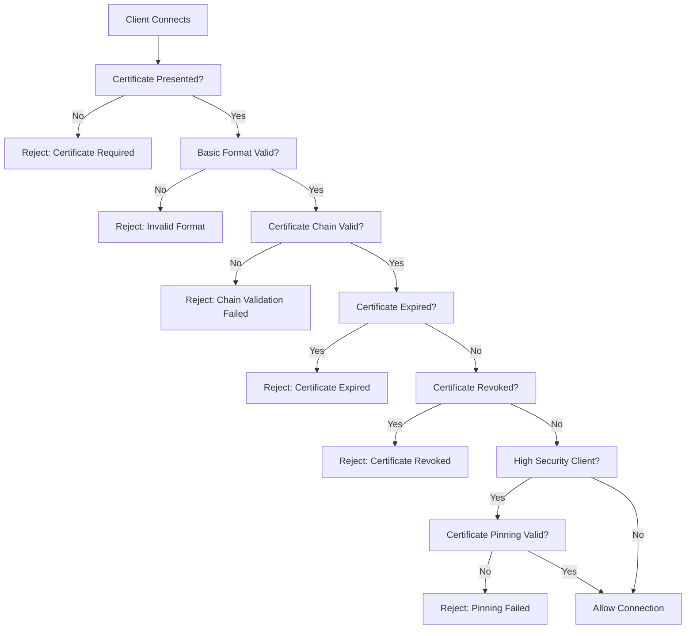

# Mutual TLS (mTLS) Authentication Guide

## Executive Summary

Mutual TLS (mTLS) provides enterprise-grade network security by requiring both client and server to authenticate each other using digital certificates. This guide covers implementation, security benefits, and operational procedures for our payment processing system.

**Key Benefits:**
- Network-level authentication before any application code runs
- Protection against credential theft and man-in-the-middle attacks
- Comprehensive audit trails and compliance support
- Layered security architecture with multiple validation points

---

## Table of Contents

1. [Introduction to mTLS](#introduction-to-mtls)
2. [Security Architecture](#security-architecture)
3. [Certificate Management](#certificate-management)
4. [Implementation Guide](#implementation-guide)
5. [Security Levels](#security-levels)
6. [Troubleshooting](#troubleshooting)
7. [Best Practices](#best-practices)
8. [Operational Procedures](#operational-procedures)

---

## Introduction to mTLS

### What is Mutual TLS?

Mutual TLS extends standard TLS by requiring **both client and server** to authenticate using digital certificates. Unlike traditional TLS where only the server proves its identity, mTLS creates bidirectional cryptographic trust.

**Traditional TLS Flow:**
```
Client → Server: "I want to connect"
Server → Client: "Here's my certificate"
Client → Server: "Certificate verified, let's establish secure connection"
```

**Mutual TLS Flow:**
```
Client → Server: "I want to connect" + [Client Certificate]
Server → CA: "Is this client certificate valid?"
CA → Server: "Yes, certificate is valid and not revoked"
Server → Client: "Client verified. Here's my certificate"
Client → Server: "Server verified, establishing secure connection"
```

### Security Promise

With mTLS, an attacker needs **ALL** of the following:
- ✅ Valid client certificate file (physical possession)
- ✅ Certificate password (knowledge factor)
- ✅ Certificate not revoked (real-time validation)
- ✅ Certificate issued by trusted CA (chain of trust)
- ✅ Valid API keys (application-level)
- ✅ Encryption algorithms (application-level)
- ✅ Payment data formats (application-level)

This multi-layered approach makes unauthorized access practically impossible.

---

## Security Architecture

### Certificate Hierarchy

```
Payment System Root CA
├── Client Certificates
│   ├── demo_client.p12 (Development)
│   ├── high_security_client_1.p12 (Enterprise)
│   ├── financial_client_bank.p12 (Financial Institution)
│   └── enterprise_client_corp.p12 (Corporate)
└── Server Certificates (Payment API)
```

### Trust Levels

#### Standard Trust (Development)
- Basic certificate validation
- Standard rate limiting
- Normal audit logging
- Flexible IP restrictions

#### High Trust (Enterprise)
- Enhanced certificate validation
- Certificate pinning validation
- OCSP revocation checking
- IP range restrictions
- Enhanced audit logging

#### Maximum Trust (Financial)
- Strict certificate pinning enforcement
- Multiple revocation checking (OCSP + CRL)
- Real-time security monitoring
- Strict IP whitelisting
- Automatic threat response

### Validation Pipeline



---

## Certificate Management

### Certificate Types

#### Development Certificates (`demo_client.p12`)
**Purpose:** Testing and development environments
**Security Features:**
- Basic format validation
- Expiration checking
- Standard certificate chain verification
- Basic revocation checking

**Configuration Example:**
```json
{
  "clientId": "demo_client",
  "securityLevel": "standard",
  "certificatePinning": false,
  "ipRestrictions": [],
  "revocationChecking": "basic"
}
```

#### Enterprise Certificates (`high_security_client_1.p12`)
**Purpose:** Production business applications
**Security Features:**
- Comprehensive certificate validation
- Certificate pinning enforcement
- OCSP revocation checking
- IP address restrictions
- Enhanced monitoring

**Configuration Example:**
```json
{
  "clientId": "high_security_client_1",
  "securityLevel": "enhanced",
  "certificatePinning": true,
  "pinnedThumbprint": "1A0793CCC030168FBB943CD17D941B94E0E2F0EC",
  "ipRestrictions": ["192.168.1.0/24"],
  "revocationChecking": "ocsp"
}
```

#### Financial Institution Certificates (`financial_client_bank.p12`)
**Purpose:** Banks and payment processors
**Security Features:**
- Certificate pinning with exact match
- Multiple revocation methods (OCSP + CRL)
- Strict IP whitelisting
- Real-time security monitoring
- Automatic blocking on violations

**Configuration Example:**
```json
{
  "clientId": "financial_client_bank",
  "securityLevel": "maximum",
  "certificatePinning": true,
  "pinnedThumbprint": "F25970C173B453B2C38F8F3D39F55BEDE502187D",
  "ipRestrictions": ["203.0.113.0/24"],
  "revocationChecking": "ocsp+crl",
  "enhancedMonitoring": true,
  "automaticBlocking": true
}
```

### Certificate Lifecycle

#### Rotation Timeline
- **90 days before expiration:** Generate new certificates
- **60 days before expiration:** Distribute to clients
- **30 days before expiration:** Enable dual acceptance
- **Expiration date:** Disable old certificates
- **30 days after expiration:** Archive old certificates

#### Emergency Revocation Process
1. **Immediate (0-1 hours):** Revoke certificate, update CRL/OCSP
2. **Short-term (1-24 hours):** Generate emergency replacement
3. **Follow-up (1-7 days):** Conduct security analysis, permanent solution

---

## Implementation Guide

### Server Configuration

#### Kestrel Setup
```csharp
// Program.cs - Configure Kestrel for mTLS
builder.WebHost.ConfigureKestrel(serverOptions =>
{
    serverOptions.ConfigureHttpsDefaults(httpsOptions =>
    {
        // Require client certificates for all connections
        httpsOptions.ClientCertificateMode = ClientCertificateMode.RequireCertificate;
        
        // Allow custom validation (handled by middleware)
        httpsOptions.AllowAnyClientCertificate();
        
        // Enable revocation checking
        httpsOptions.CheckCertificateRevocation = true;
    });
});
```

#### Certificate Validation Middleware
```csharp
public async Task<CertificateValidationResult> ValidateCertificateAsync(
    X509Certificate2 certificate, 
    string clientIp)
{
    var result = new CertificateValidationResult();
    
    // 1. Basic validation
    if (!ValidateBasicProperties(certificate, result)) 
        return result;
    
    // 2. Chain validation  
    if (!await ValidateCertificateChain(certificate, result)) 
        return result;
    
    // 3. Expiration check
    if (IsCertificateExpired(certificate, result)) 
        return result;
    
    // 4. Revocation check
    if (await IsCertificateRevoked(certificate)) 
    {
        result.IsValid = false;
        result.ErrorMessage = "Certificate has been revoked";
        return result;
    }
    
    // 5. Certificate pinning (high-security clients)
    var clientIdentity = ExtractClientIdentity(certificate);
    if (clientIdentity.IsHighSecurityClient)
    {
        if (!ValidateCertificatePinning(certificate, clientIdentity.ClientId))
        {
            result.IsValid = false;
            result.ErrorMessage = "Certificate pinning validation failed";
            return result;
        }
    }
    
    result.IsValid = true;
    result.ClientIdentity = clientIdentity;
    return result;
}
```

### Client Configuration

#### .NET Client Example
```csharp
// Configure HttpClient with client certificate
var handler = new HttpClientHandler();

// Load client certificate
var clientCertificate = new X509Certificate2(
    "certificates/demo_client.p12", 
    "client123"
);
handler.ClientCertificates.Add(clientCertificate);

// Configure server validation
handler.ServerCertificateCustomValidationCallback = ValidateServerCertificate;

var httpClient = new HttpClient(handler);
httpClient.BaseAddress = new Uri("https://api.paymentsystem.com");
```

#### Node.js Client Example
```javascript
const https = require('https');
const fs = require('fs');

const options = {
    hostname: 'api.paymentsystem.com',
    port: 443,
    cert: fs.readFileSync('/secure/path/client-cert.pem'),
    key: fs.readFileSync('/secure/path/client-key.pem'),
    ca: fs.readFileSync('/secure/path/ca-cert.pem')
};

const req = https.request(options, (res) => {
    console.log('Status:', res.statusCode);
});
```

---

## Security Levels

### Configuration by Environment

#### Development Environment
```json
{
  "Security": {
    "RequireClientCertificate": false,
    "EnableCertificatePinning": false,
    "AllowSelfSigned": true,
    "CheckRevocation": false
  }
}
```

#### Production Environment
```json
{
  "Security": {
    "RequireClientCertificate": true,
    "EnableCertificatePinning": true,
    "AllowSelfSigned": false,
    "CheckRevocation": true,
    "EnhancedLogging": true,
    "AutomaticBlocking": true
  }
}
```

### Trust Level Determination
```csharp
private CertificateTrustLevel DetermineTrustLevel(
    X509Certificate2 certificate, 
    ClientIdentity identity)
{
    // Maximum trust: Financial institutions with pinning
    if (identity.ClientType == ClientType.Financial && 
        _pinnedCertificates.ContainsKey(identity.ClientId))
    {
        return CertificateTrustLevel.Maximum;
    }
    
    // High trust: Enterprise with enhanced validation
    if (identity.ClientType == ClientType.Enterprise && 
        identity.IsHighSecurityClient)
    {
        return CertificateTrustLevel.High;
    }
    
    // Standard trust: Development and standard clients
    return CertificateTrustLevel.Standard;
}
```

---

## Troubleshooting

### Common Issues

#### "CLIENT_CERTIFICATE_REQUIRED" Error

**Symptoms:** HTTP 401 error, connection terminates during TLS handshake

**Troubleshooting Steps:**

1. **Verify certificate file exists:**
```bash
ls -la /path/to/certificate.p12
# Should show file with permissions 600
```

2. **Test certificate loading:**
```csharp
try 
{
    var cert = new X509Certificate2("path/to/cert.p12", "password");
    Console.WriteLine($"Certificate: {cert.Subject}");
    Console.WriteLine($"Valid from: {cert.NotBefore}");
    Console.WriteLine($"Valid until: {cert.NotAfter}");
}
catch (Exception ex)
{
    Console.WriteLine($"Load failed: {ex.Message}");
}
```

3. **Verify HttpClient configuration:**
```csharp
var handler = new HttpClientHandler();
handler.ClientCertificates.Add(certificate);
Console.WriteLine($"Certificates loaded: {handler.ClientCertificates.Count}");
```

#### "CERTIFICATE_PINNING_FAILED" Error

**Symptoms:** HTTP 403 error, pinning validation fails

**Troubleshooting Steps:**

1. **Check certificate thumbprint:**
```bash
openssl x509 -in certificate.pem -fingerprint -sha1 -noout
# Output: SHA1 Fingerprint=1A:07:93:CC:C0:30:16:8F:BB:94:3C:D1:7D:94:1B:94:E0:E2:F0:EC
```

2. **Verify server configuration:**
```json
{
  "Security": {
    "PinnedCertificates": {
      "your_client_id": "1A0793CCC030168FBB943CD17D941B94E0E2F0EC"
    }
  }
}
```

#### "Certificate Chain Validation Failed" Error

**Symptoms:** Chain validation fails during TLS handshake

**Troubleshooting Steps:**

1. **Verify certificate chain:**
```bash
openssl verify -CAfile ca-cert.pem client-cert.pem
# Should output: client-cert.pem: OK
```

2. **Check chain order:**
```bash
openssl x509 -in certificate.pem -text -noout | grep -A5 "Issuer:"
openssl x509 -in ca-cert.pem -text -noout | grep -A5 "Subject:"
```

### Monitoring and Debugging

#### Enable detailed logging:
```csharp
builder.Logging.AddFilter("PaymentSystem.Security", LogLevel.Debug);
```

#### Monitor certificate usage:
```bash
# Check validation logs
grep "certificate_validated" /var/log/payment-system/security.log

# Monitor failures
grep "certificate_validation_failed" /var/log/payment-system/security.log
```

---

## Best Practices

### Certificate Security

#### Storage and Protection
- **Server-side:** Store CA private key in HSM or secure vault
- **Client-side:** Set file permissions to 600 (owner read/write only)
- Use strong passwords for PKCS#12 files
- Never store certificates in source code or version control
- Implement regular security audits

#### Distribution Process
1. Use encrypted channels (secure FTP, encrypted email)
2. Communicate passwords out-of-band
3. Require installation confirmation
4. Provide clear installation instructions
5. Maintain audit trail

### Operational Excellence

#### Certificate Expiration Monitoring
```csharp
public async Task CheckCertificateExpirations()
{
    var warningPeriod = TimeSpan.FromDays(30);
    var criticalPeriod = TimeSpan.FromDays(7);
    
    foreach (var client in authorizedClients)
    {
        var cert = await GetClientCertificate(client.Id);
        var timeToExpiry = cert.NotAfter - DateTime.UtcNow;
        
        if (timeToExpiry < criticalPeriod)
        {
            await SendCriticalAlert(
                $"Certificate for {client.Id} expires in {timeToExpiry.Days} days"
            );
        }
        else if (timeToExpiry < warningPeriod)
        {
            await SendWarningAlert(
                $"Certificate for {client.Id} expires in {timeToExpiry.Days} days"
            );
        }
    }
}
```

#### Performance Optimization
- Cache validation results (10-minute TTL)
- Cache OCSP responses appropriately
- Implement fallback strategies for OCSP failures
- Use OCSP stapling when possible
- Monitor validation performance metrics

### Compliance and Governance

#### Documentation Requirements
- Maintain comprehensive certificate inventory
- Document all lifecycle procedures
- Record certificate distribution events
- Establish clear roles and responsibilities
- Regular policy reviews and updates

#### Audit and Compliance
- Quarterly security policy reviews
- Annual penetration testing
- Regular compliance assessments (PCI DSS, SOC 2)
- Third-party security audits
- Documented incident response procedures

---

## Operational Procedures

### Certificate Rotation Procedure

#### Pre-Rotation (90 days before expiration)
1. Generate new certificates with updated metadata
2. Conduct security review and approval
3. Prepare distribution packages
4. Update certificate pinning configurations

#### Distribution Phase (60 days before expiration)
1. Distribute new certificates to all clients
2. Provide installation and testing instructions
3. Coordinate migration timeline with clients
4. Verify client receipt and testing completion

#### Transition Phase (30 days before expiration)
1. Enable dual certificate acceptance on server
2. Monitor certificate usage patterns
3. Provide migration support to clients
4. Verify all clients have migrated successfully

#### Completion Phase (Expiration date)
1. Disable old certificates
2. Verify no clients using old certificates
3. Begin cleanup and archival process
4. Update documentation

### Emergency Response Procedures

#### Immediate Response (0-1 hours)
1. Revoke compromised certificate
2. Update CRL and OCSP responder
3. Block certificate in validation systems
4. Generate emergency replacement certificate

#### Short-term Response (1-24 hours)
1. Distribute emergency certificate to client
2. Verify connectivity with new certificate
3. Monitor for usage of revoked certificate
4. Coordinate permanent solution

#### Follow-up (1-7 days)
1. Conduct security incident analysis
2. Generate permanent replacement certificate
3. Update security procedures if needed
4. Complete incident documentation

### Monitoring and Alerting

#### Key Metrics
- Certificate validation success rates
- Certificate expiration dates
- Revocation check performance
- Certificate pinning violations
- Client connection patterns

#### Alert Thresholds
- **Critical:** Certificate expires in 7 days
- **Warning:** Certificate expires in 30 days
- **Error:** Certificate validation failure rate > 5%
- **Security:** Certificate pinning violation detected
- **Operational:** OCSP responder unavailable

---

## Conclusion

Mutual TLS provides robust network-level security that forms the foundation of our payment system's defense-in-depth architecture. By requiring cryptographic proof of identity from both clients and servers, mTLS creates an impenetrable barrier that operates before any application-level security measures.

The comprehensive validation pipeline, certificate lifecycle management, and operational procedures outlined in this guide ensure that our mTLS implementation maintains the highest security standards while providing operational flexibility and performance.

Regular review and updates of these procedures, combined with continuous monitoring and improvement, ensure that our mTLS implementation remains effective against evolving security threats while supporting our business objectives.